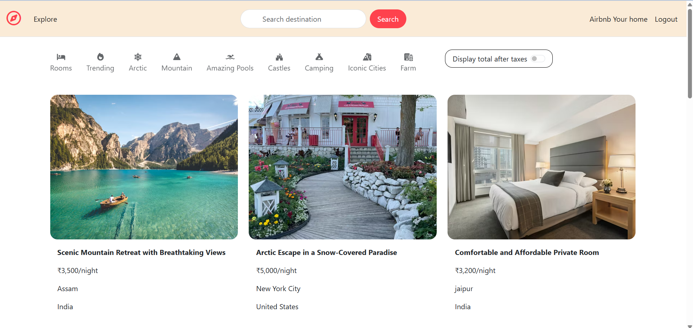
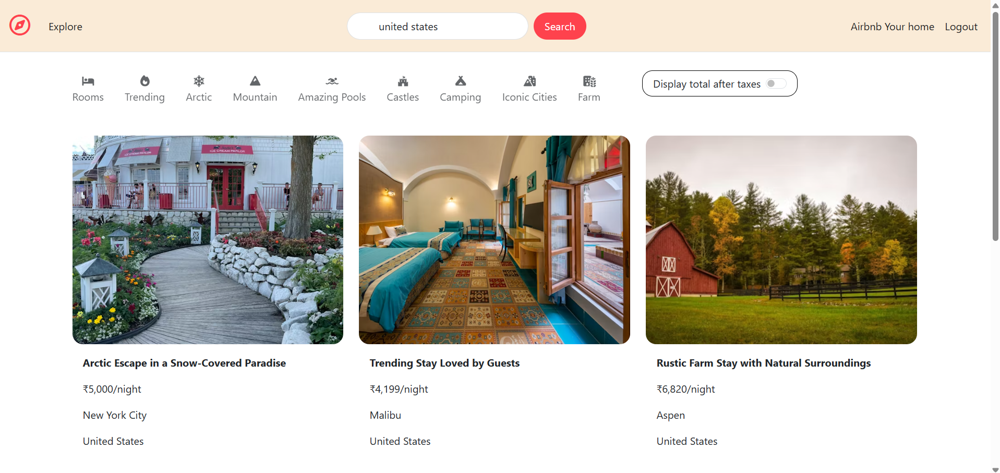
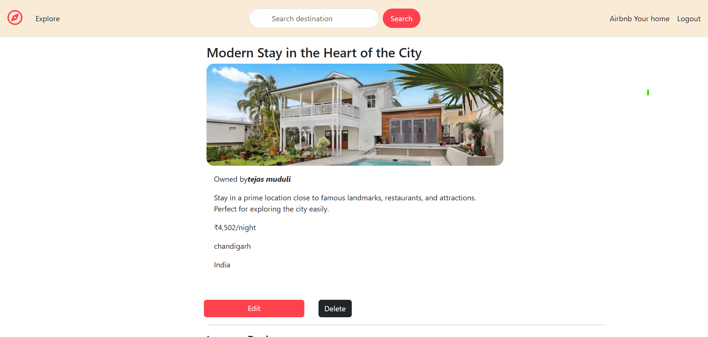
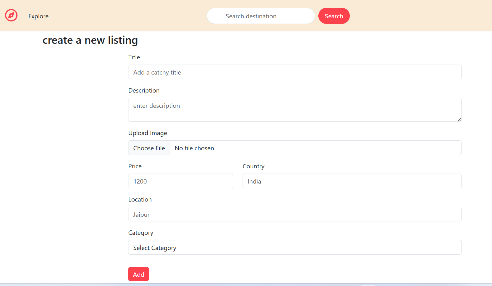
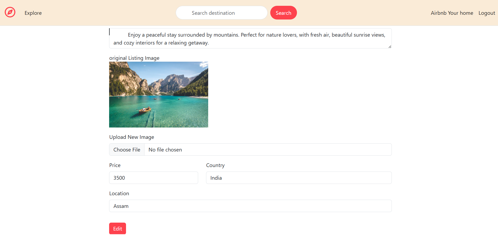

# 🌍 Wanderlust

A full-stack travel listing web application inspired by Airbnb, where users can explore, create, and review unique stays across different locations.

---

## 🚀 Features

- 🔍 Search listings by location, country, and title  
- 🗂 Category-based filtering  
- 🔐 User authentication (Signup/Login)  
- 🏡 Add, edit, and delete listings  
- ⭐ Review and rating system  
- 📷 Image upload for listings  

---
## 🌐 Live Demo

👉 https://stay-abode.onrender.com


## 🛠 Tech Stack

- Node.js  
- Express.js  
- MongoDB  
- EJS  
- Bootstrap  

---

## 📸 Screenshots

### 🏠 Home Page


### 🔍 Search Feature


### 📄 Listing Details Page


### ➕ Create Listing


### ✏️ Edit Listing


### ⭐ Review System


---

## ⚙️ Installation & Setup

1. Clone the repository:
```bash
git clone https://github.com/beherakiran/PROJECT.git
